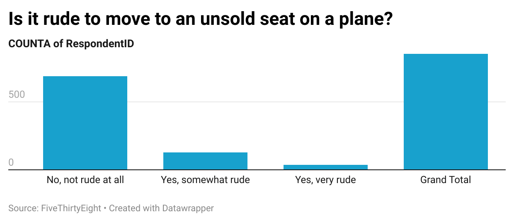

# Week-4

I decided that this question in particular is the one that I would choose because it is a widespread airline issue that most flyers can relate to. It is different from other etiquette questions with definite yes or no answers, but seat switching falls under the gray area between social norms and personal comfort. The overwhelming majority at 80.7% says that it is not rude. This was rather surprising and shows how practical comfort takes precedence over strict adherence to assigned seating where personal inconvenience to others is not at stake. This really challenges fundamental assumptions about airplane etiquette and passenger behavior.

